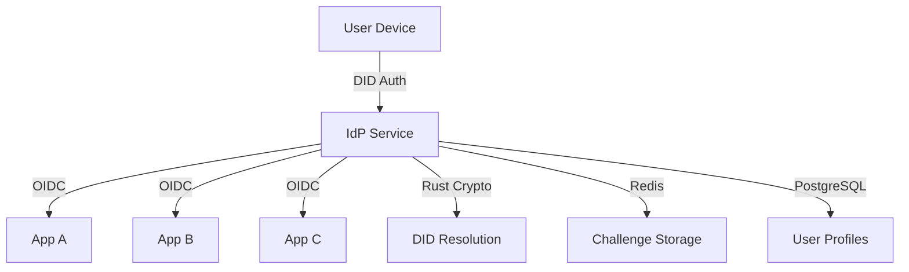
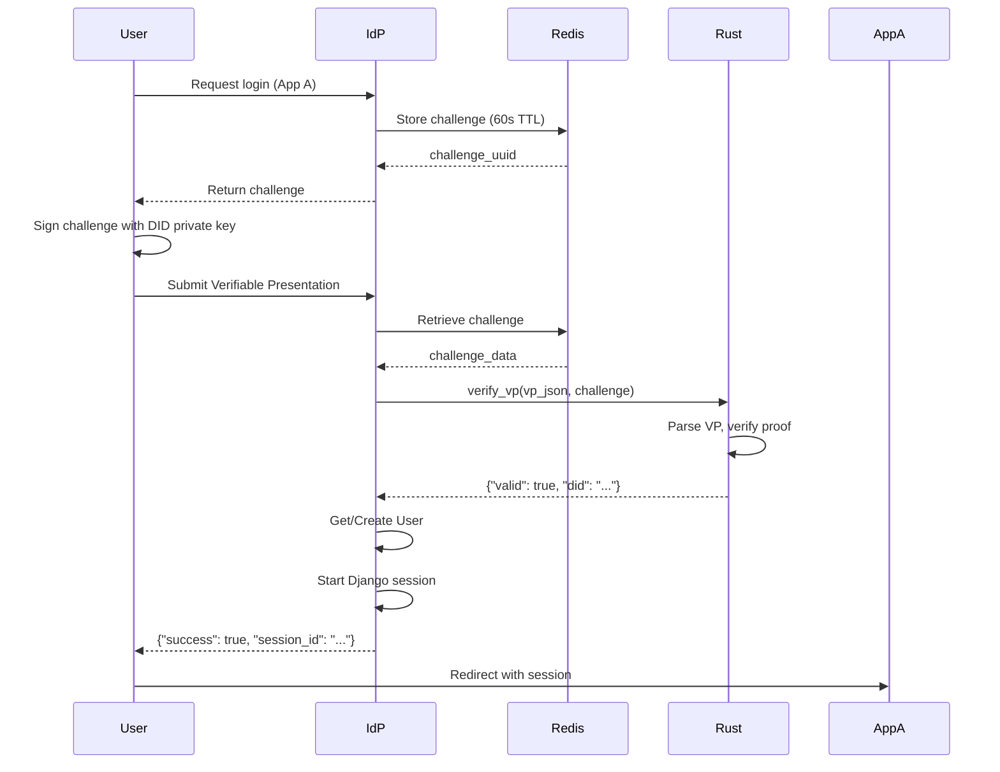

# Developer Guide: Sovereign Identity Provider (IdP)

## Overview

This guide provides comprehensive documentation for developers working on the Sovereign Identity Provider (IdP) project. The IdP acts as a bridge between Decentralized Identifiers (DIDs) and OpenID Connect (OIDC) protocols.

## Architecture



## Project Structure

```bash
.
├── config/                  # Django project configuration
│   ├── settings.py         # Main Django settings
│   └── urls.py             # URL routing
├── auth_bridge/             # Core authentication bridge
│   ├── models.py           # User model and database schemas
│   ├── views.py            # Authentication views
│   ├── urls.py             # App-specific URLs
│   ├── oidc.py             # Custom OIDC claims
│   └── crypto.py           # Rust bridge utilities
├── src/                     # Rust extension source
│   └── lib.rs             # Rust-Python bridge
├── crates/rust-did/         # Rust DID library
│   └── src/lib.rs          # DID cryptographic functions
├── Cargo.toml              # Rust dependencies
├── pyproject.toml           # Python dependencies
└── manage.py               # Django management
```

## Setup & Installation

### Prerequisites

- Python 3.10+
- Rust 1.60+
- Redis 6.0+
- PostgreSQL 13+ (recommended)
- Django 5.2+
- Maturin (for Rust-Python binding)

### Installation

```bash
# Clone the repository
git clone https://github.com/yourorg/iyou-idp.git
cd iyou-idp

# Set up virtual environment
python -m venv .venv
source .venv/bin/activate

# Install Python dependencies
uv sync

# Build Rust extension
maturin develop

# Set up database
python manage.py migrate

# Start Redis
redis-server

# Run development server
python manage.py runserver
```

## Core Components

### 1. User Model

The custom User model uses DID as the primary identifier:

```python
class User(AbstractBaseUser):
    id = models.AutoField(primary_key=True)
    username = models.CharField(max_length=255, unique=True)  # Stores DID
    is_active = models.BooleanField(default=True)
    is_staff = models.BooleanField(default=False)
    is_superuser = models.BooleanField(default=False)
    date_joined = models.DateTimeField(default=timezone.now)

    USERNAME_FIELD = 'username'  # DID is stored here
```

### 2. Challenge-Response Flow



### 3. Rust Bridge

The Rust extension provides cryptographic verification:

```rust
#[pyfunction]
fn verify_vp(vp_json: String, challenge: String) -> PyResult<String> {
    // Parse Verifiable Presentation
    // Verify cryptographic proof
    // Check challenge matches
    // Validate expiration
    // Return structured result
}
```

### 4. OIDC Provider

Custom OIDC claims ensure DID is the subject:

```python
def custom_id_token_claims(user, scope, claims, **kwargs):
    claims_dict = claims.default_id_token_claims(user, scope, claims, **kwargs)
    claims_dict['sub'] = user.username  # DID as subject
    claims_dict['did'] = user.username
    return claims_dict
```

## API Endpoints

### Authentication Endpoints

| Endpoint | Method | Description | Request | Response |
|----------|--------|-------------|---------|----------|
| `/auth/challenge/` | POST | Generate new challenge | - | `{"challenge": "uuid", "expires_in": 60}` |
| `/auth/challenge/` | GET | Health check | - | `{"status": "operational"}` |
| `/auth/verify/` | POST | Verify VP and authenticate | `{"verifiable_presentation": {...}, "challenge": "uuid"}` | `{"success": true, "user": {...}, "session_id": "..."}` |

### OIDC Endpoints

| Endpoint | Description |
|----------|-------------|
| `/openid/.well-known/openid-configuration` | OIDC discovery |
| `/openid/authorize` | Authorization endpoint |
| `/openid/token` | Token endpoint |
| `/openid/userinfo` | UserInfo endpoint |
| `/openid/jwks` | JWKS endpoint |

## Development Workflow

### Adding New Features

1. **Rust Changes**: Modify `src/lib.rs` or `crates/rust-did/src/lib.rs`
2. **Rebuild**: `maturin develop`
3. **Python Changes**: Modify Django models/views
4. **Migrations**: `python manage.py makemigrations` then `python manage.py migrate`
5. **Test**: Run specific tests or manual API testing

### Testing

```bash
# Run all tests
python manage.py test

# Test specific app
python manage.py test auth_bridge

# Manual API testing
curl -X POST http://localhost:8000/auth/challenge/
```

### Debugging

```bash
# Check Redis challenges
redis-cli -n 1 KEYS "*"

# Django shell
python manage.py shell

# Rust tests
cargo test

# Check logs
tail -f /var/log/iyou-idp.log
```

## Error Handling

### Common Errors & Solutions

| Error | Cause | Solution |
|-------|-------|----------|
| `Challenge not found or expired` | Challenge TTL expired (60s) | Request new challenge |
| `Missing verifiableCredential` | Invalid VP structure | Ensure VP has required fields |
| `Signature verification failed` | Invalid cryptographic proof | Check DID and signature |
| `User account is disabled` | User.is_active = False | Enable user in admin |
| `Redis connection error` | Redis not running | Start Redis service |

### Error Response Format

```json
{
    "error": "Human-readable error message",
    "status_code": 400,
    "timestamp": "2023-01-01T00:00:00Z",
    "request_id": "abc123"
}
```

## Deployment

### Production Checklist

- [ ] Set `DEBUG = False` in settings
- [ ] Configure proper secret key
- [ ] Set up PostgreSQL database
- [ ] Configure Redis with password
- [ ] Set up HTTPS with Let's Encrypt
- [ ] Configure CORS for allowed origins
- [ ] Set up logging and monitoring
- [ ] Configure rate limiting
- [ ] Set up backup for database
- [ ] Configure health checks

### Docker Deployment

```dockerfile
FROM python:3.10-slim

# Install system dependencies
RUN apt-get update && apt-get install -y \
    build-essential \
    libssl-dev \
    redis-server \
    && rm -rf /var/lib/apt/lists/*

# Install Rust
RUN curl https://sh.rustup.rs -sSf | sh -s -- -y
ENV PATH="/root/.cargo/bin:${PATH}"

# Set up project
WORKDIR /app
COPY . .

# Build
RUN uv sync && maturin develop --release

# Run
CMD ["gunicorn", "config.wsgi:application", "--bind", "0.0.0.0:8000"]
```

## Security Considerations

### Best Practices

1. **Never store private keys** - All cryptographic operations happen client-side
2. **Short-lived challenges** - 60-second TTL prevents replay attacks
3. **HTTPS everywhere** - Mandatory for all endpoints
4. **CORS restrictions** - Only allow trusted origins
5. **Rate limiting** - Prevent brute force attacks
6. **Input validation** - Validate all JSON inputs
7. **Session security** - Use secure, HttpOnly cookies

### Vulnerability Management

- Regular dependency updates with `uv sync`
- Rust security audits with `cargo audit`
- Python security scans with `bandit`
- Regular penetration testing

## Performance Optimization

### Caching Strategy

- **Redis**: Challenge storage with 60s TTL
- **Django cache**: User sessions and frequent queries
- **CDN**: Static assets and OIDC discovery documents

### Database Optimization

```python
# Add indexes for frequently queried fields
class User(AbstractBaseUser):
    username = models.CharField(max_length=255, unique=True, db_index=True)
    
    class Meta:
        indexes = [
            models.Index(fields=['username']),  # DID lookup
            models.Index(fields=['is_active']),  # Active user filter
        ]
```

## Troubleshooting

### Rust-Python Bridge Issues

```bash
# Check if Rust module is built
ls -la src/iyou_idp/_crypto.abi3.so

# Rebuild if missing
maturin develop --release

# Test Rust function directly
python -c "from iyou_idp._crypto import verify_vp; print(verify_vp('{}', 'test'))"
```

### OIDC Configuration Issues

```bash
# Check OIDC discovery endpoint
curl http://localhost:8000/openid/.well-known/openid-configuration

# Verify custom claims are loaded
python manage.py shell -c "from auth_bridge.oidc import custom_userinfo_claims; print('OIDC loaded')"
```

## Contributing

### Code Style

- **Python**: Follow PEP 8, use type hints
- **Rust**: Follow Rust API guidelines
- **Commit Messages**: Use conventional commits
- **Documentation**: Update docs for all changes

### Pull Request Process

1. Fork the repository
2. Create feature branch: `git checkout -b feature/your-feature`
3. Commit changes: `git commit -m "feat: add your feature"`
4. Push branch: `git push origin feature/your-feature`
5. Open Pull Request
6. Wait for review and CI checks
7. Merge after approval

## Roadmap

### Short-term Goals

- [ ] Real cryptographic verification in Rust
- [ ] Challenge matching validation
- [ ] VP expiration checking
- [ ] Production monitoring setup

### Long-term Goals

- [ ] Federation support (multiple IdP instances)
- [ ] Desktop app integration
- [ ] Mobile SDK
- [ ] Revocation registry support
- [ ] Multi-factor authentication options

## Support

For issues, questions, or contributions:

- **GitHub Issues**: https://github.com/yourorg/iyou-idp/issues
- **Documentation**: https://docs.yourproject.com
- **Community**: https://community.yourproject.com
- **Security**: security@yourproject.com

## License

This project is licensed under the MIT License. See the LICENSE file for details.

---

*Last updated: 2023-11-15*
*Maintainers: @core-team*
