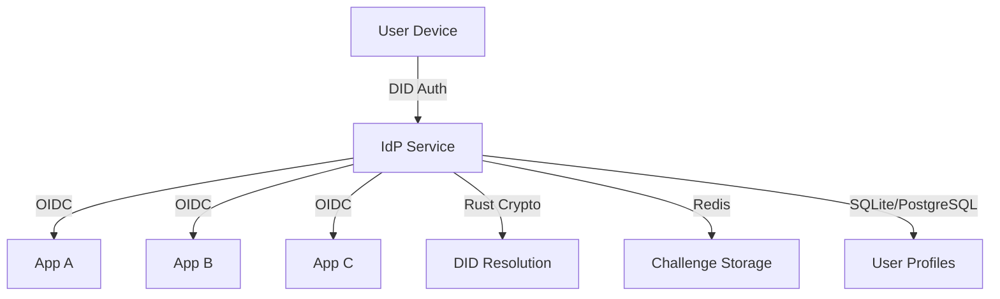
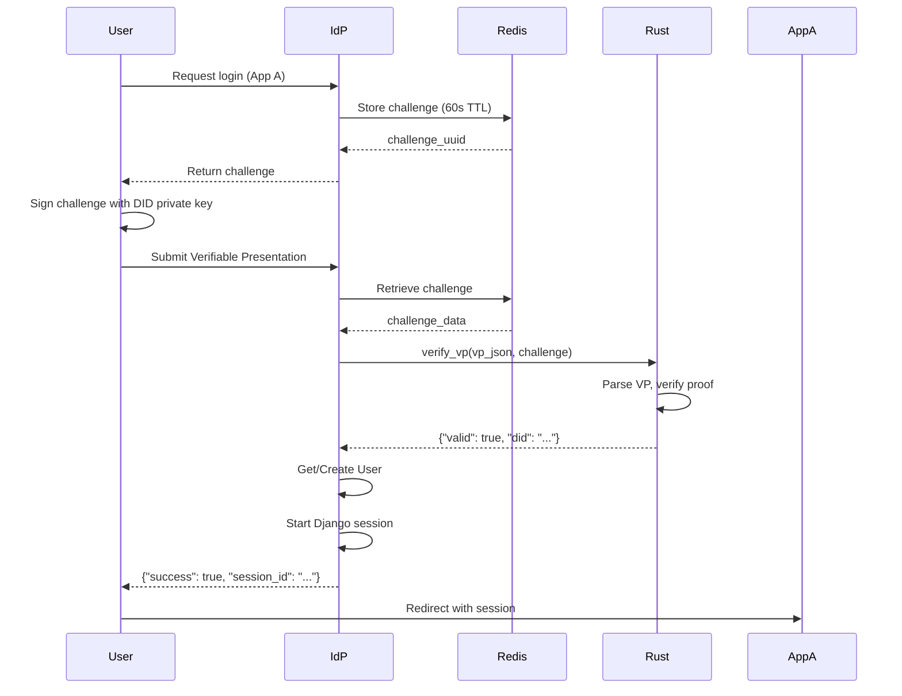

# Developer Guide: Sovereign Identity Provider (IdP)

## Overview

This guide provides comprehensive documentation for developers working on the Sovereign Identity Provider (IdP) project. The IdP acts as a bridge between Decentralized Identifiers (DIDs) and OpenID Connect (OIDC) protocols.

## Architecture



## Project Structure

```bash
.
├── config/                  # Django project configuration
│   ├── __init__.py
│   ├── settings.py         # Main Django settings
│   ├── urls.py             # URL routing
│   └── wsgi.py             # WSGI entrypoint
├── auth_bridge/             # Core authentication bridge
│   ├── __init__.py
│   ├── admin.py            # Admin registration (empty)
│   ├── admin_views.py      # Custom admin DID auth views
│   ├── apps.py             # Django AppConfig
│   ├── backend.py          # DID auth backend
│   ├── crypto.py           # Rust bridge health check
│   ├── models.py           # User model and UserManager
│   ├── oidc.py             # Custom OIDC claims
│   ├── urls.py             # App-specific URLs
│   ├── views.py            # Challenge/verify/login views
│   ├── migrations/
│   │   └── 0001_initial.py # Initial User model migration
│   └── templates/
│       ├── auth_bridge/
│       │   └── login.html  # DID login page (Tailwind CSS)
│       └── admin/
│           ├── did_login.html      # Admin DID login template
│           └── did_dashboard.html  # Admin DID dashboard
├── src/                     # Rust-Python bridge (PyO3)
│   ├── lib.rs              # PyO3 _crypto module
│   └── iyou_idp/
│       ├── __init__.py     # Exports hello_from_bin
│       └── _core.pyi       # Type stubs
├── crates/rust-did/         # Rust DID library (submodule)
│   ├── Cargo.toml          # Crate config
│   └── src/
│       ├── lib.rs          # C FFI: generate DID, issue/verify VC/VP, resolve DID
│       └── resolver.rs     # DID resolvers: did:key, did:web, did:ipfs
├── Cargo.toml              # Root Rust crate (PyO3 bridge)
├── Cargo.lock              # Root Rust lockfile
├── pyproject.toml          # Python/maturin config
├── uv.lock                 # Python dependency lockfile
├── .gitmodules             # Git submodule config (crates/rust-did)
├── manage.py               # Django management CLI
└── DEVELOPER_GUIDE.md      # This file
```

## Setup & Installation

### Prerequisites

- Python 3.10+
- Rust 1.60+
- Redis 6.0+
- SQLite (dev) or PostgreSQL 13+ (production)
- Django 5.2+
- Maturin (for Rust-Python binding)

### Installation

```bash
# Clone the repository
git clone https://github.com/yourorg/iyou-idp.git
cd iyou-idp

# Initialize submodules
git submodule update --init --recursive

# Set up virtual environment
python -m venv .venv
source .venv/bin/activate

# Install Python dependencies
uv sync

# Build Rust extension
maturin develop

# Set up database
python manage.py migrate

# Start Redis
redis-server

# Run development server
python manage.py runserver
```

## Core Components

### 1. User Model

The custom User model uses DID as the primary identifier, with a companion `UserManager`:

```python
class UserManager(BaseUserManager):
    def create_user(self, did: str, **extra_fields):
        if not did:
            raise ValueError('The DID must be set')
        user = self.model(username=did, **extra_fields)
        user.save(using=self._db)
        return user

    def create_superuser(self, did: str, **extra_fields):
        extra_fields.setdefault('is_staff', True)
        extra_fields.setdefault('is_superuser', True)
        return self.create_user(did, **extra_fields)


class User(AbstractBaseUser):
    id = models.AutoField(primary_key=True)
    username = models.CharField(
        max_length=255, unique=True,
        help_text='DID string', default='did:placeholder'
    )
    is_active = models.BooleanField(default=True)
    is_staff = models.BooleanField(default=False)
    is_superuser = models.BooleanField(default=False)
    date_joined = models.DateTimeField(default=timezone.now)

    USERNAME_FIELD = 'username'
    REQUIRED_FIELDS = []

    objects = UserManager()

    def __str__(self):
        return self.username

    def has_perm(self, perm, obj=None):
        return self.is_superuser

    def has_module_perms(self, app_label):
        return self.is_superuser

    class Meta:
        indexes = [
            models.Index(fields=['username']),
            models.Index(fields=['is_active']),
        ]
```

### 2. Challenge-Response Flow



### 3. Rust Bridge

The PyO3 bridge (`src/lib.rs`) exposes three functions to Python:

```rust
#[pyfunction]
fn hello_from_bin() -> String  // Bridge connectivity check

#[pyfunction]
fn verify_signature(did: String, challenge: String, signature: String) -> bool
    // Basic parameter non-empty check (mock)

#[pyfunction]
fn verify_vp(vp_json: String, challenge: String) -> PyResult<String>
    // Parse VP, check for verifiableCredential & proof fields
    // Extract DID from holder or proof.verificationMethod
    // Returns {"valid": true, "did": "..."} (mock verification)
```

The bridge **currently uses mock verification**. Real ed25519 cryptographic verification
exists in the `crates/rust-did` submodule (C FFI) but is not yet wired into the PyO3 bridge.

### 4. Creating a Superuser

Use the custom management command (the standard `createsuperuser` does not work):

```bash
# Password will be prompted interactively:
python manage.py createsuperuser_did --did dadmin

# Or pass via env var (non-interactive):
DJANGO_SUPERUSER_PASSWORD="strong-pass" python manage.py createsuperuser_did --did dadmin --no-input

# Or pass directly:
python manage.py createsuperuser_did --did dadmin --password "strong-pass"
```

**Arguments:**

| Argument | Default | Description |
|----------|---------|-------------|
| `--did` | `did:admin:superuser` | DID string stored as username |
| `--password` | `None` | Password for admin fallback login |
| `--no-input` | off | Skip interactive prompts |

The password falls back to the `DJANGO_SUPERUSER_PASSWORD` environment variable if `--password` is not provided.

### 5. Authentication Backend

Two backends are configured (in order):

1. **`DIDAuthBackend`** — Allows login by DID alone; ignores password. Used by `/auth/admin/did-login/`.
2. **`ModelBackend`** — Standard password check. Used by `/admin/` for users with a password set.

```python
class DIDAuthBackend(ModelBackend):
    def authenticate(self, request, username=None, password=None, **kwargs):
        User = get_user_model()
        if username is None:
            return None
        try:
            user = User.objects.get(username=username)
            if user.is_active:
                return user
        except User.DoesNotExist:
            return None
        return None
```

> **Alpha phase:** During development, admins can log in at `/admin/` using their DID string (stored in `username`) as the username and the password set via `createsuperuser_did`. This is a fallback while DID tooling is still in development. The high-security path at `/auth/admin/did-login/` remains available for VP-based authentication.

### 5. OIDC Provider

Custom OIDC claims ensure DID is the subject:

```python
def custom_userinfo_claims(user, scope, claims, id_token=None, token=None, **kwargs):
    from oidc_provider.lib import claims as oidc_claims
    claims_dict = oidc_claims.default_userinfo_claims(
        user, scope, claims, id_token, token, **kwargs
    )
    claims_dict['sub'] = user.username   # DID as subject
    claims_dict['did'] = user.username
    claims_dict['preferred_username'] = user.username
    return claims_dict


def custom_id_token_claims(user, scope, claims, id_token=None, token=None, **kwargs):
    from oidc_provider.lib import claims as oidc_claims
    claims_dict = oidc_claims.default_id_token_claims(
        user, scope, claims, id_token, token, **kwargs
    )
    claims_dict['sub'] = user.username
    claims_dict['did'] = user.username
    return claims_dict
```

## API Endpoints

### Authentication Endpoints

| Endpoint | Method | Description | Request | Response |
|----------|--------|-------------|---------|----------|
| `/auth/challenge/` | POST | Generate new challenge | - | `{"challenge": "uuid", "expires_in": 60}` |
| `/auth/challenge/` | GET | Health check | - | `{"status": "auth_bridge operational"}` |
| `/auth/verify/` | POST | Verify VP and authenticate | `{"verifiable_presentation": {...}, "challenge": "uuid"}` | `{"success": true, "user": {...}, "session_id": "..."}` |
| `/auth/login/` | GET | DID login page | `?next=<redirect_url>` | HTML page |

### Admin DID Endpoints

| Endpoint | Method | Description |
|----------|--------|-------------|
| `/auth/admin/did-login/` | GET/POST | Admin DID login page / challenge generation |
| `/auth/admin/did-verify/` | POST | Verify admin DID VP and create session |
| `/auth/admin/did-dashboard/` | GET | Admin dashboard (requires login) |

### OIDC Endpoints

| Endpoint | Description |
|----------|-------------|
| `/openid/.well-known/openid-configuration` | OIDC discovery |
| `/openid/authorize` | Authorization endpoint |
| `/openid/token` | Token endpoint |
| `/openid/userinfo` | UserInfo endpoint |
| `/openid/jwks` | JWKS endpoint |

## Development Workflow

### Adding New Features

1. **Rust Changes (bridge)**: Modify `src/lib.rs`
2. **Rust Changes (crypto)**: Modify `crates/rust-did/src/lib.rs` or `resolver.rs`
3. **Rebuild**: `maturin develop` (also rebuilds `did_rust` crate)
4. **Python Changes**: Modify Django models/views
5. **Migrations**: `python manage.py makemigrations` then `python manage.py migrate`
6. **Test**: Run specific tests or manual API testing

### Testing

```bash
# Run all Django tests
python manage.py test

# Test specific app
python manage.py test auth_bridge

# Rust tests (submodule)
(cd crates/rust-did && cargo test)

# Manual API testing
curl -X POST http://localhost:8000/auth/challenge/
```

### Debugging

```bash
# Check Redis challenges (db index 1)
redis-cli -n 1 KEYS "*"

# Django shell
python manage.py shell

# Rust tests (all crates)
cargo test --workspace

# Check logs
tail -f /var/log/iyou-idp.log
```

## Error Handling

### Common Errors & Solutions

| Error | Cause | Solution |
|-------|-------|----------|
| `Challenge not found or expired` | Challenge TTL expired (60s) | Request new challenge |
| `Missing verifiableCredential` | VP missing `verifiableCredential` field | Ensure VP has required fields |
| `Missing proof` | VP missing `proof` field | Ensure VP has a proof block |
| `Signature verification failed` | Invalid cryptographic proof | Check DID and signature |
| `User account is disabled` | `User.is_active == False` | Enable user in admin |
| `User is not an admin user` | Non-staff user tried admin login | Grant staff status |
| `Redis connection error` | Redis not running | Start Redis service |
| `Invalid JSON payload` | Malformed request body | Check request format |

### Error Response Format

```json
{
    "error": "Human-readable error message",
    "status_code": 400
}
```

## Deployment

### Production Checklist

- [ ] Set `DEBUG = False` in settings
- [ ] Configure proper secret key via env var
- [ ] Switch to PostgreSQL database
- [ ] Configure Redis with password
- [ ] Set up HTTPS with Let's Encrypt
- [ ] Configure CORS for allowed origins
- [ ] Set up logging and monitoring
- [ ] Configure rate limiting
- [ ] Set up backup for database
- [ ] Configure health checks

### Docker Deployment

```dockerfile
FROM python:3.10-slim

# Install system dependencies
RUN apt-get update && apt-get install -y \
    build-essential \
    libssl-dev \
    redis-server \
    && rm -rf /var/lib/apt/lists/*

# Install Rust
RUN curl https://sh.rustup.rs -sSf | sh -s -- -y
ENV PATH="/root/.cargo/bin:${PATH}"

# Set up project
WORKDIR /app
COPY . .

# Build
RUN uv sync --no-dev && maturin develop --release

# Run
CMD ["gunicorn", "config.wsgi:application", "--bind", "0.0.0.0:8000"]
```

## Security Considerations

### Best Practices

1. **Never store private keys** - All cryptographic operations happen client-side
2. **Short-lived challenges** - 60-second TTL prevents replay attacks
3. **HTTPS everywhere** - Mandatory for all endpoints
4. **CORS restrictions** - Only allow trusted origins
5. **Rate limiting** - Prevent brute force attacks
6. **Input validation** - Validate all JSON inputs
7. **Session security** - Use secure, HttpOnly cookies

## Troubleshooting

### Rust-Python Bridge Issues

```bash
# Check if Rust module is built
ls -la src/iyou_idp/_crypto.abi3.so

# Rebuild if missing
maturin develop --release

# Test Rust function directly
python -c "from iyou_idp._crypto import verify_vp; print(verify_vp('{}', 'test'))"

# Verify bridge connectivity
python -c "from iyou_idp._crypto import hello_from_bin; print(hello_from_bin())"
```

### Submodule Issues

```bash
# Initialize/update the rust-did submodule
git submodule update --init --recursive

# Build the C FFI library standalone
(cd crates/rust-did && cargo build --release)

# Run submodule tests
(cd crates/rust-did && cargo test)
```

### OIDC Configuration Issues

```bash
# Check OIDC discovery endpoint
curl http://localhost:8000/openid/.well-known/openid-configuration

# Verify custom claims are loaded
python manage.py shell -c "from auth_bridge.oidc import custom_userinfo_claims; print('OIDC loaded')"
```

## Roadmap

### Short-term Goals

- [ ] Wire `crates/rust-did` real crypto into PyO3 bridge (`src/lib.rs`)
- [ ] Challenge matching validation in Rust verification
- [ ] VP expiration checking
- [ ] Production monitoring setup

### Long-term Goals

- [ ] Federation support (multiple IdP instances)
- [ ] Desktop app integration
- [ ] Mobile SDK
- [ ] Revocation registry support
- [ ] Multi-factor authentication options

---

*Last updated: 2026-05-10*
